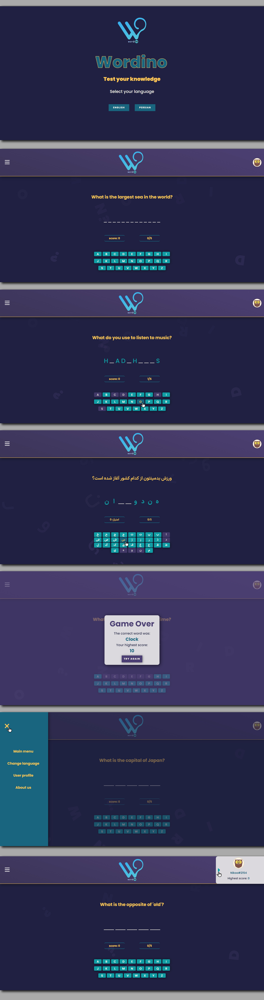

# Wordino - [Word guessing game]

## Description

### gameplay

Wordino is a game based on hang man game built using HTML, CSS, and JavaScript in english and persian language. The game challenges players to guess a word by suggesting letters, one at a time. Each correct letter guessed is revealed in the word, while incorrect guesses accumulate towards a maximum allowed limit. The game provides players with a fun and educational way to expand their vocabulary and improve their word-guessing skills.

### How to Play

1. When you start the game, a random word will be selected from a list of predefined words, and the corresponding question related to the word will be displayed.

2. The word is represented by a series of underscores, each representing a letter of the word. Players need to guess the letters one by one to complete the word.

3. Click on the on-screen keyboard buttons to suggest a letter. If the letter is correct, it will be revealed in the word, and you can continue guessing other letters.

4. If the suggested letter is incorrect, the game will keep track of the wrong guesses. Be careful not to exceed the maximum allowed wrong guesses (currently set to 5), or the game will be over.

5. The game will track your score, and each correct word completion will earn you 10 points. Your current score will be displayed in the game interface.

6. If you manage to complete the word before reaching the maximum number of wrong guesses, you win the round, earn points, and a new word will be presented for the next round.

7. The game also keeps track of your highest score. If you beat your previous high score, it will be updated in your profile.

## How to Run the Game

1. Clone or download the game repository from the provided link.

2. Open the index.html file in a web browser that supports HTML5, CSS3, and JavaScript.

3. The game will load, and you can start playing by interacting with the on-screen keyboard buttons.

4. Enjoy the Wordino game and have fun guessing words!

### Credits

The Wordino game was developed as a mid-term project for the HTML, CSS, and JavaScript course. The project was created by:
[FisherSHADOW](https://github.com/FisherSHADOW).

### Screenshots

